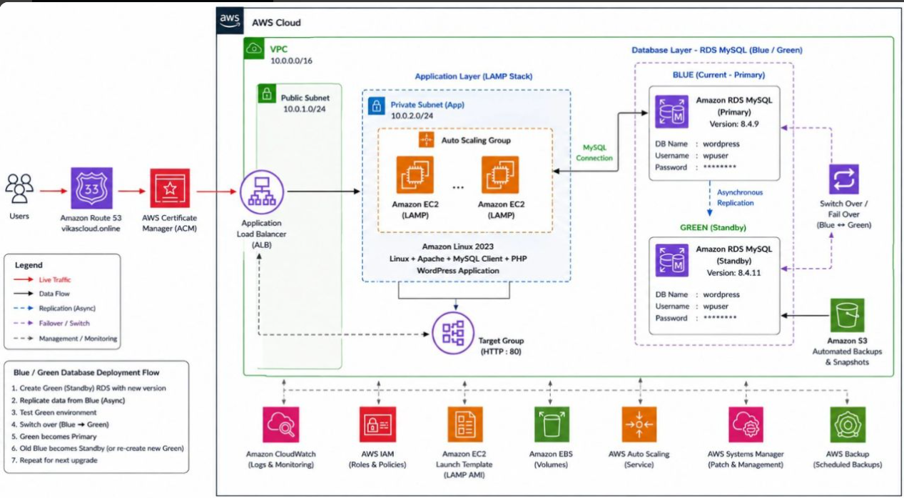

# AWS WordPress Hosting with RDS MySQL, ALB, Auto Scaling & RDS Blue/Green

## Project Overview

This project hosts a WordPress website on Amazon EC2 using a LAMP stack and Amazon RDS for MySQL.

The project also includes an Application Load Balancer, Target Group, Auto Scaling Group, EC2 Launch Template, Route 53, ACM, and an RDS Blue/Green deployment flow.

## Architecture



### Main Flow

Users  
→ Amazon Route 53  
→ Application Load Balancer (ALB)  
→ Target Group  
→ Auto Scaling Group  
→ Amazon EC2 (LAMP + WordPress)  
→ Amazon RDS MySQL

ACM provides the certificate used by the ALB HTTPS listener; application traffic does not pass through ACM.

### Database Flow

Amazon EC2 WordPress  
→ MySQL connection  
→ Amazon RDS MySQL

RDS Blue (Current/Primary)  
→ Asynchronous Replication  
→ RDS Green (Standby)

## AWS Services Used

- Amazon VPC
- Public Subnet
- Private Subnet
- Amazon EC2
- Amazon RDS for MySQL
- Application Load Balancer
- Target Group
- Auto Scaling Group
- EC2 Launch Template
- Amazon Route 53
- AWS Certificate Manager (ACM)
- Amazon CloudWatch
- AWS IAM
- AWS Systems Manager
- AWS Backup

## Implementation

The detailed implementation is kept in:

- [EC2 launch and configuration](documentation/01-ec2.md)
- [WordPress EC2 + RDS setup](documentation/02-wordpress-ec2-rds.md)
- [AMI and Launch Template](documentation/03-ami-launch-template.md)
- [Target Group](documentation/04-target-group.md)
- [Application Load Balancer](documentation/05-load-balancer.md)
- [Auto Scaling](documentation/06-auto-scaling.md)
- [Route 53 and ACM](documentation/07-route53-acm.md)
- [RDS Blue/Green deployment](documentation/08-rds-blue-green.md)
- [Troubleshooting](documentation/09-troubleshooting.md)
- [WordPress configuration example](configs/wp-config-example.php)
- [Original project notes](source/project-notes.txt)

## WordPress Deployment

The source project uses:

- Amazon Linux 2023
- Apache HTTP Server
- PHP
- MySQL/MariaDB client
- WordPress
- Amazon RDS MySQL

The original project notes contain the commands for installing the MySQL client, Apache, PHP dependencies, downloading WordPress, configuring `wp-config.php`, and copying WordPress to `/var/www/html`.

## RDS Blue/Green Deployment

The project notes describe this flow:

1. Setup another EC2 instance with the same application.
2. Create a Target Group.
3. Create a Load Balancer.
4. Create a Launch Template using the WordPress AMI.
5. Create an Auto Scaling Group.
6. Access the application using the ALB.
7. Create the Green RDS environment.
8. Replicate data from Blue to Green using asynchronous replication.
9. Test the Green environment.
10. Switch over from Blue to Green.
11. Green becomes Primary.
12. Old Blue can be deleted or used to recreate Green for the next upgrade.

## Security

Do not upload real credentials to GitHub.

Use placeholders such as:

```text
DB_HOST=<RDS_ENDPOINT>
DB_NAME=wordpress
DB_USER=<DB_USERNAME>
DB_PASSWORD=<DB_PASSWORD>
```

Do not commit:

- AWS Access Keys
- AWS Secret Keys
- Real database passwords
- Private keys
- Real `.env` files
- Sensitive WordPress configuration containing credentials

## Project Files

```text
aws-wordpress-rds-blue-green/
├── README.md
├── .gitignore
├── architecture/
│   └── architecture-diagram.png
├── documentation/
│   ├── 01-ec2.md
│   ├── 02-wordpress-ec2-rds.md
│   ├── 03-ami-launch-template.md
│   ├── 04-target-group.md
│   ├── 05-load-balancer.md
│   ├── 06-auto-scaling.md
│   ├── 07-route53-acm.md
│   ├── 08-rds-blue-green.md
│   └── 09-troubleshooting.md
├── configs/
│   └── wp-config-example.php
├── screenshots/
│   ├── ec2.png
│   ├── ami.png
│   ├── rds.png
│   ├── alb.png
│   ├── target-group.png
│   ├── autoscaling.png
│   └── route53.png
└── source/
    └── project-notes.txt
```

The screenshots directory contains redacted AWS Console captures. ACM and RDS Blue/Green captures are not included yet.

## GitHub Upload

After extracting this ZIP:

```bash
git init
git add .
git commit -m "Add AWS WordPress RDS Blue Green project"
git branch -M main
git remote add origin <YOUR_GITHUB_REPOSITORY_URL>
git push -u origin main
```

Or create a GitHub repository and upload these files using the GitHub web interface.

## Project Source

The detailed steps in this repository are based on the project notes supplied for this project.
